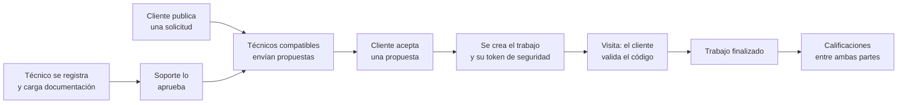

# 🔧 MiTécnico

**Plataforma web de intermediación de servicios técnicos verificados**
---

## 🎓 Datos académicos

| | |
|---|---|
| **Universidad** | Universidad Tecnológica Nacional (UTN) |
| **Facultad** | Facultad Regional La Plata (**UTN-FRLP**) |
| **Materia** | Desarrollo de Software |
| **Comisión** | S31 |
| **Año** | 2026 |

## 👥 Integrantes

<!-- COMPLETAR: nombre, apellido y usuario de GitHub de cada integrante -->

| Integrante | Responsabilidad principal | GitHub |
|---|---|---|
| _Rey Lautaro_ | Infraestructura, acceso y administración | [@Lautaro Rey](https://github.com/l4uty) |
| _Quiroz Pablo_ | Técnicos, validación y zonas | [@Pablo](https://github.com/14Pablo14) |
| _Rial Rodrigo_ | Solicitudes, propuestas y trabajos | [@Rodrigo Rial](https://github.com/rodrigo-rial) |
| _Balbuena Dana_ | Token, reputación y urgencias | [@Dana Balbuena](https://github.com/dana-balbuena) |

---

## 📖 ¿Qué es MiTécnico?

MiTécnico vincula a **clientes que necesitan una reparación** con **técnicos previamente verificados**. Funciona desde cualquier navegador (computadora, tablet o celular), sin necesidad de una aplicación móvil nativa.

La plataforma actúa como **intermediaria tecnológica**: permite registrar usuarios, publicar solicitudes, recibir propuestas, elegir al profesional, validar su identidad durante la visita y construir reputación a partir de los trabajos realizados. MiTécnico no es empleador de los técnicos ni participa de la relación comercial entre las partes: el pago se acuerda por fuera de la plataforma.

## 🔄 ¿Cómo funciona?



1. El **técnico** completa su perfil y su documentación; **soporte** la revisa y lo aprueba.
2. El **cliente** publica una solicitud indicando especialidad, zona y domicilio.
3. Los técnicos aprobados cuya **especialidad y zona coinciden** envían propuestas.
4. El cliente **acepta una propuesta**: se crea el trabajo y las demás propuestas se rechazan.
5. Durante la visita, un **código de seis dígitos** confirma que quien llega es el técnico asignado.
6. Al finalizar, cliente y técnico **se califican mutuamente**.

## 🧑‍🤝‍🧑 Roles

| Rol | Qué puede hacer |
|---|---|
| **Cliente** | Publicar solicitudes, recibir y aceptar propuestas, validar al técnico y calificar |
| **Técnico** | Completar su perfil profesional, ver solicitudes compatibles, enviar propuestas y realizar trabajos |
| **Soporte / Administrador** | Revisar documentación y aprobar, rechazar o bloquear usuarios |

## 🧩 Módulos

| # | Módulo | Qué resuelve |
|---|---|---|
| 1 | **Gestión de usuarios y perfiles** | Registro, inicio de sesión (JWT), roles y perfil profesional del técnico |
| 2 | **Oferta y demanda** | Solicitudes, propuestas y creación del trabajo |
| 3 | **Seguridad y validación** | Verificación manual de técnicos y token de seis dígitos para la visita |
| 4 | **Sistema de reputación** | Calificaciones bidireccionales, promedio y fotografías de trabajos |
| 5 | **Canal de urgencias** | Atención rápida por especialidad, zona y disponibilidad |

## 🎯 Alcance

**Incluye**
- Gestión diferenciada de clientes, técnicos y soporte
- Validación administrativa manual de técnicos (DNI y matrícula)
- Coincidencia por **especialidad y zonas predefinidas**
- Propuestas con descripción, precio estimado y fecha disponible
- Token de seguridad para la visita
- Calificaciones y reseñas en ambos sentidos
- Diseño responsive, pensado primero para celulares (_mobile first_)

**No incluye**
- Pasarela de pagos, cobros ni reembolsos
- Geolocalización o seguimiento en tiempo real
- Chat en tiempo real, notificaciones push ni SMS
- Validación automática con organismos oficiales ni reconocimiento facial
- Aplicación móvil nativa

## 🛠️ Tecnologías

| Capa | Tecnología |
|---|---|
| **Frontend** | React, Vite, React Router, Tailwind CSS |
| **Backend** | Python, Django, Django REST Framework |
| **Base de datos** | PostgreSQL |
| **Autenticación** | JWT (access y refresh token) |
| **Infraestructura** | Docker y Docker Compose |
| **Control de versiones** | Git y GitHub (ramas `main`, `develop` y `feature/*`) |

## 🗂️ Estructura del repositorio
 
```
mitecnico/
├── backend/             # API REST con Django y DRF
├── frontend/            # Interfaz web con React
├── docs/                # Documentación del proyecto
├── docker-compose.yml   # Servicios: frontend, backend y db
├── .env.example         # Variables de entorno de ejemplo
└── README.md
```


## 🚀 Inicio rápido

> La guía completa de instalación, variables de entorno y cuentas de prueba se incorporará próximamente.

```bash
cp .env.example .env
docker compose up -d --build
docker compose exec backend python manage.py migrate
docker compose exec backend python manage.py createsuperuser
```

- **API y panel de administración:** `http://localhost:8000` (administración en `/admin`)
- **Frontend:** servidor de Vite (por defecto, `http://localhost:5173`)

## 📚 Documentación

La documentación detallada (endpoints, permisos, modelos de datos, pantallas y pruebas) se publicará en la carpeta [`docs/`](./docs).

## 📌 Estado del proyecto

🚧 **En desarrollo.** Versión académica orientada a un recorrido completo y demostrable.

---

<div align="center">

Proyecto académico desarrollado para la cátedra de **Desarrollo de Software** · **UTN-FRLP**

</div>
